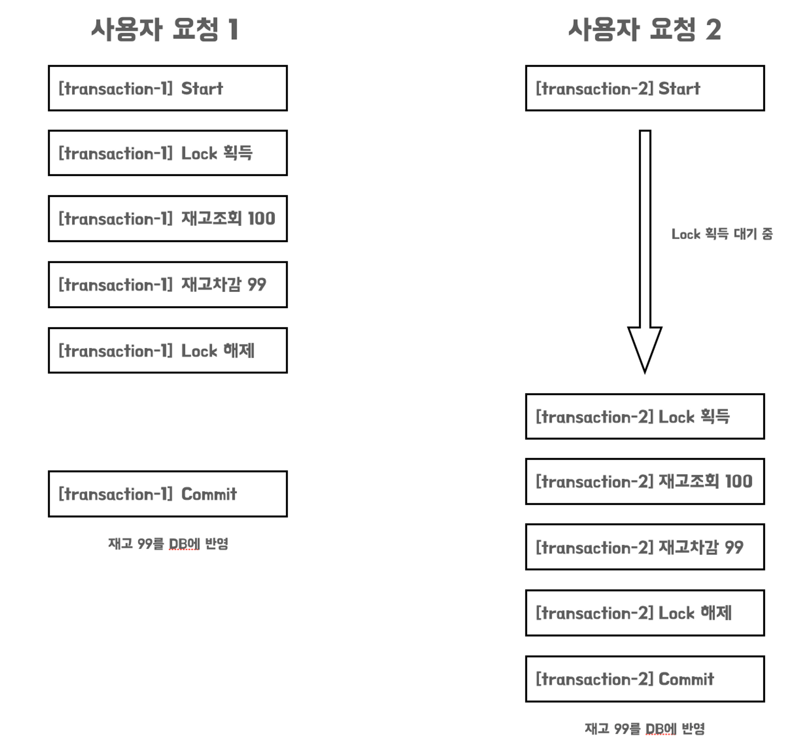
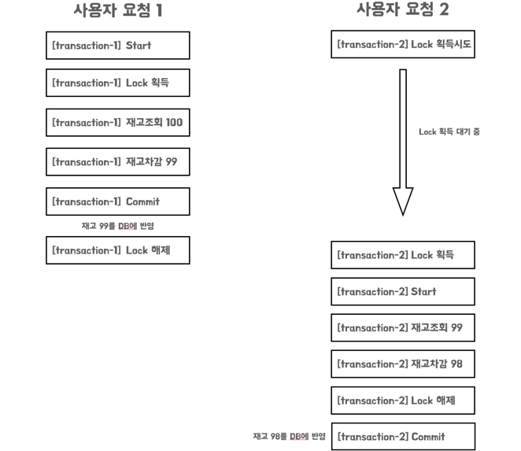

저번 글에서는 트랜잭션의 관점에서 어떻게 동시성 문제를 해결하는지 살펴보고, Spring에서는 어떻게 트랜잭션을 지원하는지 살펴보는 시간을 가졌었습니다.

이번 시간에서는 요구사항을 구현하기 위해 추가적으로 필요한 개념과 실제 코드를 통해 동시성 문제를 해결해보는 과정을 한번 작성해보려고 합니다.

## 분산 환경에서 동시성 문제를 해결하기 위해 고민해야 할 점

일반적으로 웹 어플리케이션을 개발하게 된다면 프로세스를 단 하나만 사용하는 서비스는 거의 없습니다. 대량의 사용자 요청을 받아내기 위해서 분산 환경을 운용하여 부하를 분산하게 됩니다. 이러한 조건 때문에 기본적으로 단일 환경에서 사용할 수 있는 동시성 제어를 위한 기능들은 사용을 할 수 없습니다.

이러한 **분산 환경에서도 공유 자원에 대한 상호 배제를 구현해서 동시성 문제를 해결하는 방법 중 하나가 바로 분산 락** 입니다. 기본적으로 분산 락은 락에 대한 정보를 어떠한 공간에 보관하는 작업을 수행합니다. 그리고 보관된 공간에 대해서 여러 분산 환경에서도 공통되게 바라볼 수 있는 환경을 구축하고, 해당 환경들이 공유 자원에 접근할 수 있는지 확인하는 작업을 수행하며 동작이 이루어지게 됩니다. 이를 통해서 분산 환경에서도 공유 자원에 대한 상호 배제를 수행할 수 있게 됩니다.

이러한 분산 락을 구현하기 위한 기술로는 MySQL의 Named Lock과 Redis, Zookeeper가 존재합니다. 저는 Redis를 사용해서 분산 락을 구현하기로 하였습니다. Redis를 사용한 이유는 Single Thread 기반으로 동작하기 때문에 동시성을 제어할 때 좋은 선택이라는 생각이 들었고, 락을 보관하는 정보과 휘발성 데이터에 가깝다고 생각했기 때문에 Memory DB인 Redis를 사용하기로 결정하였습니다.

## Redis를 활용하기 위한 방법 고민하기

Redis를 사용하기로 결정하였으므로 어떻게 Redis를 이용해 Lock을 수행해야 할지 고민해야 했습니다. 크게 스핀 락과 Message Broker 방식 중에서 고민하였습니다.

### 스핀 락

먼저 고민한 방법은 스핀 락 방법입니다. 스핀 락은 락을 사용할 수 있을 때 까지 지속적으로 계속 확인을 요청하며 기다리는 방식을 말합니다. 즉, 레디스 서버에 지속적으로 락을 획득할 수 있는지 확인 요청을 보내어 공유 자원 획득여부를 확인하는 방식으로 구현을 고민해볼 수 있습니다.

Redis에서는 `SETNX` 명령을 통해서 이를 구현할 수 있습니다. Key 값을 식별할 수 있는 유니크 값으로 설정하고 Value 값을 “Lock”을 의미하는 값으로 두어 각 요청마다 Key의 Lock 유무를 판단해 스핀 락을 구현할 수 있습니다. 이러한 환경을 구축하는 Redis Client로는 `Lettuce`를 활용하여 구현할 수 있습니다.

이렇게 스핀 락을 구현하게 되면 위에서 언급한 Redis Client인 `Lettuce` 만으로 간단하게 구현을 할 수 있습니다. 하지만 스핀 락이 가지는 단점인 계속 요청을 하여 서버에 부하를 줄 수 있다는 점 때문에 해당 방법은 사용하지 않았습니다.

### Message Broker

다음으로 고민한 방법은 Message Broker라는 방법입니다. Redis에서 `SUBSCRIBE` 명령을 통해 특정 채널을 구독하고, `PUBLISH` 명령으로 특정 채널에 메시지를 발행할 수 있는 기능을 제공하고 있습니다. 이러한 원리를 이용해 락을 해제하는 프로세스에서 락을 대기하는 프로세스에게 “락 획득 시도 메시지”라는 PUBLISH 명령으로 메시지를 발행하게 되면 분산 락을 구현할 수 있습니다.

이러한 방법을 사용할 수 있도록 Redis의 Message Broker 기능을 활용한 `Redisson` 라이브러리를 통해 분산 락 기능을 간단하게 구현할 수 있습니다.

이렇게 Message Broker 기능을 통해 분산 락을 구현하게 되면 스핀락 방식이 아니므로 불필요한 트래픽이 발생하지 않아 서버의 부하를 낮출 수 있다는 장점이 있어 이번 구현에서는 Message Broker 방식을 사용하기로 하였습니다.

## Annotation 기반의 분산 락 구현하기

Message Broker 방식의 분산 락을 구현하면서 스프링 AOP를 사용하여서 `@Transactional`과 같이 Annotation 기반으로 분산 락을 적용하기로 하였습니다. 이렇게 Annotation 기반으로 구현을 한 이유는 다음과 같습니다.

- 분산 락을 적용하고자 하는 코드에 어노테이션만 사용하면 분산락을 처리할 수 있음
- 공통적으로 반복되는 코드를 제거할 수 있음
- 비즈니스 로직과 분산 락을 처리하는 로직의 관심사를 분리하여 코드를 작성할 수 있음

이러한 이유들을 기반으로 하여 이제 Annotation을 기반으로 분산 락을 작성해보도록 하겠습니다. 먼저 분산락을 적용하기 위한 어노테이션을 작성해줍니다.

```java
@Target(ElementType.METHOD)
@Retention(RetentionPolicy.RUNTIME)
public @interface DistributeLock {
    String key(); 

    TimeUnit timeUnit() default TimeUnit.SECONDS; 

    long waitTime() default 5L; 

    long leaseTime() default 3L;
}
```

분산 락을 적용하기 위해서는 각 요청에 유니크한 Key가 필요합니다. 이러한 이유 때문에 Annotation에서 Key를 받을 수 있도록 기능을 제공하도록 코드를 작성합니다. 또한 분산 락에 필요한 시간을 설정해주기 위해 락 획득 대기 시간과, 임대 시간을 설정해줄 수 있는 기능을 제공하도록 코드를 작성하여 Annotation을 완성합니다.

이렇게 개발된 Annotation을 선언한 메소드를 호출했을때 실행되는 Asepct를 개발해주도록 하겠습니다.`@Around` 어노테이션을 이용해서 `PointCut`을 설정하고 실제 부가기능을 구현할 Advice를 작성해줍니다. 먼저 실제 호출해야 하는 정보가 담겨있는 객체(ProceedingJoinPoint)와 호출한 메서드에 선언되어 있는 `@DistributeLock` 정보를 가져오는 로직을 작성해줍니다.

```java
public class DistributeLockAspect {

    private final RedissonClient redissonClient;

    @Around("@annotation(com.woowacourse.kkogkkog.common.distribute.DistributeLock)")
    public Object lock(final ProceedingJoinPoint joinPoint) throws Throwable {
        MethodSignature signature = (MethodSignature) joinPoint.getSignature();
        Method method = signature.getMethod();
        DistributeLock lock = method.getAnnotation(DistributeLock.class);
    }
}
```

`@DistributeLock`에는 락의 Key로 사용하기 위해 전달한 정보가 있습니다. 해당 정보(Key)를 가져오기 위해 `SpringEL`을 파싱하는 작업을 수행하여 정보를 가져오는 작업을 수행해줍니다.

```java
private Object getDynamicValueParser(final String[] parameterNames, final Object[] args, final String key) {
	ExpressionParser parser = new SpelExpressionParser();
  StandardEvaluationContext context = new StandardEvaluationContext();

  for (int i = 0; i < parameterNames.length; i++) {
      context.setVariable(parameterNames[i], args[i]);
  }

  return parser.parseExpression(key).getValue(context, Object.class);
}
```

그리고 가져온 키를 바탕으로 `Redisson`에 해당 락의 `RLock`의 인터페이스를 가져오는 작업을 수행합니다.

```java
RLock rLock = redissonClient.getLock(key);
```

이후 try-catch 메서드를 이용해서 `Lock` 획득을 시도하는 로직을 작성해줍니다. 만약 획득이 실패할경우 분기문을 통해서 `Lock`이 해제 될 때까지 `SUBSCRIBE`를 수행하는 로직을 수행해줍니다.

```java
try {
    boolean available = rLock.tryLock(distributeLock.waitTime(), distributeLock.leaseTime(), distributeLock.timeUnit());
    if (!available) {
        return false;
    }
}
```

만약 `Lock` 획득에 성공했다면 실제 선언된 메서드의 로직을 수행합니다. 이때 우리가 고려해줘야 할 점이 있습니다. 바로 **실제 선언된 메서드가 호출되어 커밋이 된 이후에 `Lock`을 해제**해야 한다는 점입니다.

`Lock`을 선점한 뒤, 쿠폰의 재고 조회 및 차감에 대한 비즈니스 로직이 수행되게 되는데 이때 트랜잭션이 커밋되고 이후에 `Lock`이 해제되어야 다른 클라이언트가 잘못된 재고의 수량을 읽지 않게 됩니다.

예제를 보면 그 상황을 알 수 있습니다. [사용자 1], [사용자 2]가 동시에 재고라는 공유자원에 접근하고 있습니다. 이 때, [사용자 1]이 트랜잭션이 커밋이 되기 전 `Lock`을 해제합니다. 이 순간에 [사용자 2]가 `Lock`을 획득 해 재고의 값을 읽게 된다면 아직 [사용자 1]의 트랜잭션이 커밋되지 않아 차감이 이루어지기 전의 값을 그대로 읽어오게 됩니다.



이러한 문제를 해결하기 위해 트랜잭션이 커밋된 이후에 `Lock`을 해제하는 방법으로 변경한다면 정상적으로 우리가 원하는 결과를 얻을 수 있습니다.



이러한 개념들을 바탕으로 Advice에 로직을 구현한다면 다음과 같이 구현한다면 목표했던 Annotation 기반의 분산 락을 구현할 수 있게 됩니다.

```java
@Around("@annotation(com.woowacourse.kkogkkog.common.distribute.DistributeLock)")
public Object lock(final ProceedingJoinPoint joinPoint) throws Throwable {
    MethodSignature signature = (MethodSignature) joinPoint.getSignature();
    Method method = signature.getMethod();
    DistributeLock lock = method.getAnnotation(DistributeLock.class);

    String key = "RLOCK_" + getDynamicValueParser(signature.getParameterNames(), joinPoint.getArgs(), lock.key());
    RLock rLock = redissonClient.getLock(key);

    try {
        boolean available = rLock.tryLock(lock.waitTime(), lock.leaseTime(), lock.timeUnit());
        if (!available) {
            return false;
        }

        return aopRequiresNewTransaction.proceed(joinPoint);
    } catch (final Exception e) {
        Thread.currentThread().interrupt();
        throw new InterruptedException();
    } finally {
         rLock.unlock();
    }
}
```

## 글을 마치며

1, 2 편을 글을 정리하면서 각 트랜잭션의 격리는 어떻게 이루어지는지, 스프링에서는 이러한 트랜잭션을 제공하는지, 분산 환경에서는 어떻게 동시성을 보장해야하는지를 알 수 있었습니다. 그리고 이를 바탕으로 하여 목표했던 분산 환경에서의 상호배제도 구현을 할 수 있었습니다.

지금은 간단한 분산 환경을 가정하고 구현을 하였지만 향후 현업에서는 더 많은 트래픽을 감당하기 위해서 다중으로 분산 처리가 되어 있을 거라 생각합니다. 해당 환경에서도 지금 내용을 기반으로 하여 적절한 상호배제를 구현하는 것이 남은 숙제라는 생각이 듭니다.

> Github PR
>
- [https://github.com/wishoon/2022-KkogKkog/pull/27](https://github.com/wishoon/2022-KkogKkog/pull/27)

## 참고

- [https://redisson.org/glossary/java-distributed-lock.html](https://redisson.org/glossary/java-distributed-lock.html)
- [https://hyperconnect.github.io/2019/11/15/redis-distributed-lock-1.html](https://hyperconnect.github.io/2019/11/15/redis-distributed-lock-1.html)
- [https://d2.naver.com/helloworld/294797](https://d2.naver.com/helloworld/294797)
- [https://youtu.be/UOWy6zdsD-c?t=176](https://youtu.be/UOWy6zdsD-c?t=176)
