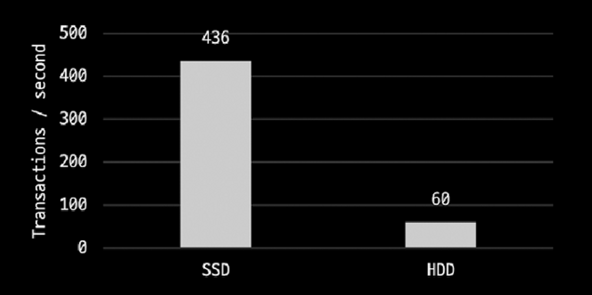
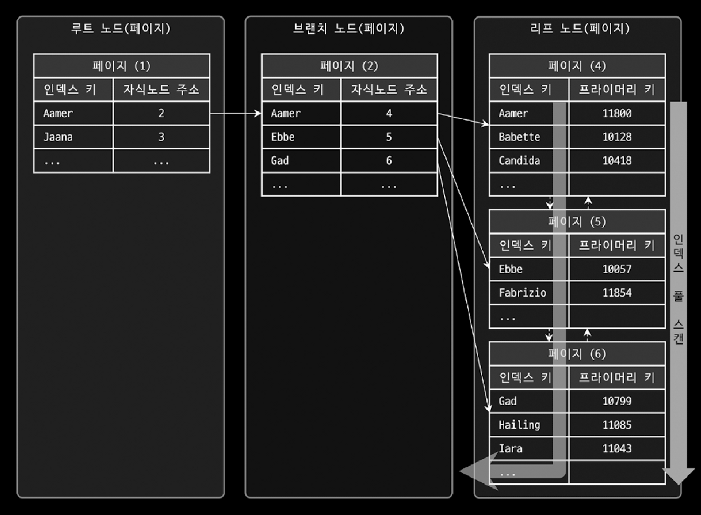
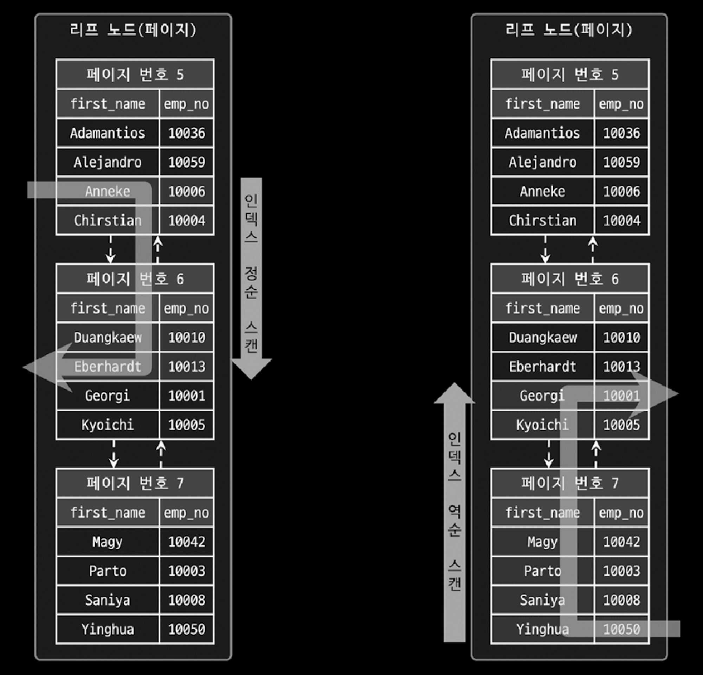
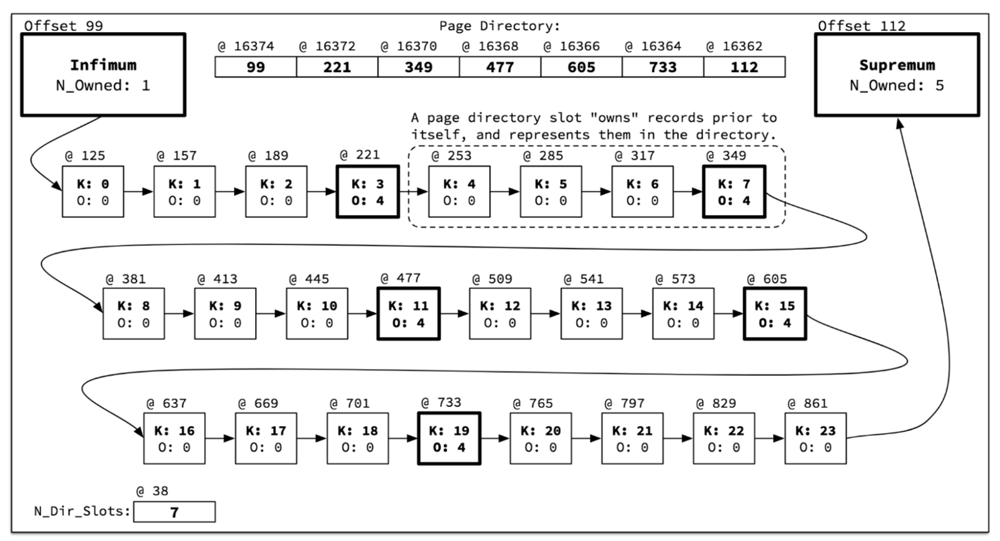

데이터베이스 쿼리 향상을 언급할 떄, 인덱스는 항상 빠지지 않고 등장하는 항목 중 하나입니다. 왜 쿼리 향상에는 인덱스에 대한 애기가 항상 나오는 걸까요?? 이번 글에서 데이터 I/O 작업에 대해서 근본적으로 살펴보면서 인덱스에 대해서 조금 더 알아보는 시간을 가져보려고 합니다.

## 저장 매체를 사용하는 방식

컴퓨터의 CPU나 메모리처럼 전기적 특성을 가지고 있는 장치의 성능은 짧은 시간 동안 빠른 속도로 발전했지만 디스크 같은 기계식 장치의 성능은 상대적으로 느리게 발전을 했습니다. 이렇게 자기 디스크 원판에 의존하는 하드 디스크의 문제를 해결하기 위해 최근에는 SSD 드라이브를 사용합니다. SSD는 기존 하드 디스크 드라이브에서 데이터를 저장하는 원판을 제거하고 플레시 메모리를 장착하고 있습니다. 이 때문에 기계적으로 원판을 회전시켜도 되지 않아 아주 빨리 데이터를 읽어올 수 있습니다.

이러한 데이터를 읽어오는 작업은 **순차 I/O**와 **랜덤 I/O**로 구분을 할 수 있습니다.

디스크의 헤더를 움직이지 않고 한 번에 많은 데이터를 읽는 순차 I/O에서는 SSD와 하드 디스크 드라이버의 성능 차이가 거의 발생하지 않습니다. 하지만 실제 데이터베이스 서버의 작업 비중에서 한 번에 많은 양의 데이터를 읽는 비중은 크지가 않습니다. **대부분의 데이터베이스 서버의 작업은 작은 데이터를 읽고 쓰는 작업**이며, 이러한 작업은 **랜덤 I/O를 통해서 수행**되게 됩니다. 랜덤 I/O가 발생하면 그 만큼 디스크 헤더의 위치 이동이 많이 발생하기 때문에, 디스크 헤더의 이동이 없는 SSD 드라이버가 훨씬 좋은 성능을 낸다고 할 수 있습니다.



### 랜덤 I/O와 순차 I/O

랜덤 I/O 라는 표현은 **하드 디스크 드라이버의 원판을 돌려서 읽어야 할 데이터가 저정된 위치로 디스크 헤더를 이동시킨 다음 데이터를 읽는 것을 의미**하는데, 순차 I/O 또한 원리는 같습니다.

하지만 차이가 생기는 점은 순차 I/O는 3개의 페이지를 디스크에 찾기 위해 1번 시스템 콜을 요청했지만, 랜덤 I/O는 3개의 페이지를 찾기 위해 3번 시스템 콜을 요청한다는 점입니다. 즉, 순차 I/O가 랜덤 I/O에 비해서 약 3배 정도 빠르다고 할 수 있으며, **디스크의 성능은 디스크 헤더의 위치 이동 없이 얼마나 많은 데이터를 한 번에 읽고 쓰는가에 따라 결정**된다고 할 수 있습니다.

SSD에서는 디스크 원판을 가지지 않기 때문에 순차 I/O와 랜덤 I/O가 차이가 없을 것으로 보이지만, **SSD 드라이버에서도 랜덤 I/O는 순차 I/O에 비해 전체 처리량이 떨어집니다**.

여기서 우리는 인덱스를 사용하는 목적을 알 수 있습니다. 사실 쿼리를 튜닝해서 랜덤 I/O를 순차 I/O로 변경해서 실행할 방법은 거의 없다고 할 수 있습니다. 즉, 랜덤 I/O를 순차 I/O로 변경하여 성능을 향상시키는 것이 아니라 **랜덤 I/O를 줄여서 데이터베이스 성능을 향상시키는 것이 목적이며, 목적을 이루기 위한 수단으로 인덱스를 사용**한다고 할 수 있습니다.

<br>

## 인덱스가 수행되는 원리

인덱스는 검색 속도를 빠르게 하기 위해서 데이터베이스의 공간에 특정 컬럼들을 정렬하는 자료구조라고 할 수 있습니다. 여기서 저희가 살펴보아야 할 점은 **‘데이터베이스 공간에 특정 컬럼들을 정렬한다’** 입니다. 값들이 항상 정렬되어 있기 때문에 찾고자 하는 값을 빠르게 찾아올 수 있는 것 입니다. 이러한 인덱스는 InnoDB에서는 **B-Tree라는 자료구조를 통해서 각 데이터들을 관리**합니다.

### B-Tree 인덱스

일반적으로 InnoDB에서는 B-Tree 기반의 알고리즘을 사용한 인덱스를 사용합니다. (정확하게는 조금 변형된 B+Tree를 사용합니다)

일반적으로 B-Tree는 트리 구조의 최상단에 루트 노드가 존재하고, 그 하위에 자식 노드들이 붙어 있는 형태입니다. 여기서 가장 하위에 있는 자식 노드를 리프 노드라고 명칭하는데, **리프 노드는 항상 실제 데이터 레코드를 찾아가기 위한 주소값**을 가지고 있습니다. 특히 **InnoDB에서는 기본적으로 테이블의 레코드들이 PK의 순서대로 정렬되어 저장되기 때문에 물리적으로 테이블 레코드들이 저장**된다고 할 수 있습니다.

이렇게 트리 형태로 구축된 인덱스를 검색하는 과정을 트리 탐색이라고 부르는데, 최상단 루트 노드에서 원하는 값이 있는 리프 노드를 찾는 방식으로 동작을 수행합니다.

### 인덱스를 통한 레코드 읽기

인덱스를 통해 테이블의 레코드를 읽는 것은 인덱스를 거치치 않고 바로 테이블의 레코드를 읽는 것보다 높은 비용이 드는 작업입니다. (랜덤 I/O로 동작하기 때문)

예를 들어, 테이블에 레코드가 100만 건이 저장되어 있다고 가정하고, 그 중에서 50만 건을 읽어야 하는 쿼리가 있다고 가정을 해보겠습니다. **전체 테이블을 모두 순차적으로 읽어**서 필요 없는 50만 건을 버리는 것이 효율적인지, **인덱스를 통해 랜덤하게 읽어**서 50만 건만 읽어 오는 것이 효율적인지를 판단할 수 있어야 합니다.

일반적으로 DBMS의 옵티마이저에서는 **인덱스를 통해 레코드 1건을 읽는 것이 테이블에서 직접 레코드 1건을 읽는 것보다 4 ~ 5배 정도 비용이 더 많이 들어간다**고 합니다. 즉, 인덱스를 통해 읽어야 할 레코드의 건수가 전체 테이블 레코드의 20 ~ 25%를 넘어서면 인덱스를 이용하지 않고 테이블을 모두 직접 읽는 방식으로 처리하는게 효율적이라고 할 수 있습니다.

<br>

## B-Tree 자료구조에서의 인덱스 수행 방법

### 인덱스 레인지 스캔

인덱스 레인지 스캔은 **검색해야 할 인덱스의 범위가 결정되었을 때 사용하는 방식**입니다. 인덱스 접근 방법 가운데 가장 대표적인 접근 방식으로, 인덱스 사용시 최적화된 방법 중 하나라고 할 수 있습니다.

루트 노드에서 찾고자 하는 최초의 리프 노드를 탐색한 후, 해당 리프 노드와 연결된 리프 노드를 선형 탐색하는 방법으로 동작합니다. 이러한 인덱스 레인지 스캔 방식은 크게 2가지 방법으로 분류할 수 있습니다.

- 실제 인덱스 데이터만 읽는 경우
- 실제 데이터 파일의 레코드를 읽어와야 하는 경우

위의 실제 데이터 파일의 레코드를 읽어와야 하는 경우에는 **랜덤 디스크 I/O가 발생**하게 됩니다. 레코드 한 건 단위로 랜덤 I/O가 발생하기 때문에 이를 유의해서 인덱스를 설정해야 합니다.


만약 이렇게 인덱스를 사용하면서도 데이터 파일의 레코드를 읽어오지 않도록 하기 위해서는 **커버링 인덱스**라는 방법을 사용해야 합니다. 찾고자 하는 레코드의 값들을 인덱스에 저장하기 때문에 랜덤 I/O가 줄어들고 조회에 대한 성능 이점을 가져갈 수가 있습니다.

### 인덱스 풀 스캔

인덱스 레인지 스캔과 마찬가지로 인덱스를 사용하지만 인덱스 레인지 스캔과는 달리 **인덱스의 처음부터 끝까지 모두 읽는 방식을 인덱스 풀 스캔**이라고 합니다. 일반적으로 인덱스의 크기는 테이블의 크기보다 작으므로 직접 테이블을 처음부터 끝까지 읽는 것보다는 인덱스만 읽는 것이 효율적입니다.

단, **인덱스뿐만 아니라 데이터 레코드까지 모두 읽어야 한다면 절대 이 방식으로 처리가 되지 않습니다**. 쿼리가 인덱스에 명시된 칼럼만으로 조건을 처리할 수 있는 경우에 주로 이 방식이 사용됩니다.



위의 그림을 보면 인덱스의 리프 노드의 제일 앞(뒤)로 이동한 후, **연결되어 있는 리프 노드들을 따라서 처음부터 끝까지 탐색하는 방식으로 동작**하게 됩니다. 이는 인덱스 레인지 스캔보다는 빠르진 않지만 테이블 풀 스캔보다는 훨신 적은 디스크 I/O가 발생하기 때문에 효율적이라고 할 수 있습니다.

<br>

## 다중 컬럼 인덱스

실제 서비스용 데이터베이스에서는 2개 이상의 칼럼을 포함하는 인덱스가 더 많이 사용됩니다. 이를 다중 컬럼 인덱스라고 부릅니다. **다중 컬럼 인덱스가 저장되는 관점에서 이를 살펴보면 앞의 컬럼에 의존해서 정렬이 이루어지는 것을 확인**할 수 있습니다. 즉, 다중 칼럼 인덱스에서는 인덱스 내에서 각 컬럼의 위치가 매우 중요하다는 것을 알 수 있습니다.


<br>

## InnoDB에서의 인덱스 정렬 및 스캔 방향

인덱스를 생성할 때 개발자가 설정한 정렬 규칙에 따라서 **인덱스의 키 값은 항상 오름차순이나 내림차순으로 정렬**되어 저장됩니다. 하지만 인덱스가 정렬된 것과는 다르게 인덱스를 읽는 곳의 위치에 따라서 읽는 방향이 달라질 수 있습니다. 이렇게 **인덱스를 어느 방향으로 읽으지는 각 쿼리에 따라서 옵티마이저의 실행 계획에 따라 결정**된다고 할 수 있습니다.

인덱스는 MySQL 5.7 이하 버전에서는 항상 오름차순으로 정렬되어 있었지만, 인덱스를 최댓값부터 거꾸로 읽으면 내림차순으로 값을 가져오게 됩니다. 다음 그림을 통해서도 이를 확인할 수 있습니다.



즉, 인덱스 생성 시점에 오름차순 또는 내림차순으로 정렬이 결정되지만 **쿼리가 인덱스를 사용하는 시점에 인덱스를 읽는 방향에 따라 오름차순 또는 내림차순 정렬 효과**를 얻을 수 있습니다.

여기서 놀라운 점은 데이터 조회 시, 오름차순과 내림차순의 성능차이가 발생한다는 점입니다. 책 Real MySQL 8.0의 내용에서도 알 수 있듯이, 데이터가 1천만건을 기준으로 조회하였을 때, **오름차순 정렬이 내림차순 정렬보다 성능이 좋다는** 것을 알 수 있습니다.


하지만 이부분은 이해가 잘 되지 않습니다. InnoDB는 **각 페이지 간의 더블 링크드 리스트를 통해서 전진과 후진을 할 수 있기 때문**입니다. 이 때문에 해당 단서만으로는 왜 성능차이가 발생하는지 잘 이해가 되지 않았습니다.

책과 검색을 통해 찾아본 결과 실제 InnoDB에서는 다음 2가지 이유 때문에 후진으로 검색하는게 느리다는 것을 알 수 있었습니다.

- **페이지 잠금이 Forward Index Scan에 적합한 구조**
- **페이지 내에서 인덱스 레코드는 단방향으로만 연결된 구조 (Forwarded Single Linked Link)**

### 페이지 잠금이 Forward Index Scan에 적합한 구조

먼저 **Forward Index Scan**에 적합한 구조에 대해서 알아보겠습니다.

InnoDB의 페이지 잠금 방식은 Forward Index Scan을 중심으로 구현되어 있는데, 해당 방식으로 인덱스 리프 페이지를 읽을 때는 밑의 코드와 같이 **Forward Scan 순서대로 페이지의 잠금을 걸고 해제하는 순서로 동작**하게 됩니다.

```java
void btr_pcur_move_to_next_page(
/*=======================*/
    btr_pcur_t* cursor, /*!< in: persistent cursor; must be on the
                last record of the current page */
    mtr_t*      mtr)    /*!< in: mtr */
{
    // ... skip ...

    page = btr_pcur_get_page(cursor);
    next_page_no = btr_page_get_next(page, mtr);

    // ... skip ...
    
    buf_block_t*    block = btr_pcur_get_block(cursor);

    // 다음 페이지를 찾아서, 잠금 획득
    next_block = btr_block_get(
        page_id_t(block->page.id.space(), next_page_no),
        block->page.size, mode,
        btr_pcur_get_btr_cur(cursor) -> index, mtr);

    next_page = buf_block_get_frame(next_block);

    // ... skip ...
    
    // 다음 페이지 잠금 획득 후, 현재 페이지의 잠금을 해제
    btr_leaf_page_release(btr_pcur_get_block(cursor), mode, mtr);

    // ... skip ...
}
```

그렇다면 **Backward Index Scan**시 페이지 잠금을 획득하는 코드는 과연 어떤 방법으로 동작을 하게 될까요?? 다음 코드를 보면 그 차이를 알 수 있습니다.

```java
void btr_pcur_move_backward_from_page(
/*=============================*/
        btr_pcur_t*     cursor, /*!< in: persistent cursor, must be on the first
                                record of the current page */
        mtr_t*          mtr)    /*!< in: mtr */
{
    // ... skip ...
    // 커서의 현재 상태 백업
    btr_pcur_store_position(cursor, mtr);

    mtr_commit(mtr);  // Mini-transaction 커밋 (페이지 잠금 해제)

    mtr_start(mtr);   // Mini-transaction 시작

    // BTR_SEARCH_PREV 모드로 커서 복구
    btr_pcur_restore_position(latch_mode2, cursor, mtr);

    page = btr_pcur_get_page(cursor);

    prev_page_no = btr_page_get_prev(page, mtr);

    /* For intrinsic table we don't do optimistic restore and so there is
       no left block that is pinned that needs to be released. */
    if (!dict_table_is_intrinsic(
         btr_cur_get_index(btr_pcur_get_btr_cur(cursor)) -> table)) {

        if (prev_page_no == FIL_NULL) {
        } else if (btr_pcur_is_before_first_on_page(cursor)) {

            prev_block = btr_pcur_get_btr_cur(cursor) -> left_block;
            // 불필요시 현재 페이지 잠금 해제
            btr_leaf_page_release(btr_pcur_get_block(cursor), latch_mode, mtr);

            page_cur_set_after_last(prev_block, btr_pcur_get_page_cur(cursor));
         } else {
            /* The repositioned cursor did not end on an infimum
               record on a page. Cursor repositioning acquired a latch
               also on the previous page, but we do not need the latch:
               release it. */

            prev_block = btr_pcur_get_btr_cur(cursor) -> left_block;
            // 불필요시 이전 페이지 잠금 해제
            btr_leaf_page_release(prev_block, latch_mode, mtr);
        }
    }

    cursor -> latch_mode = latch_mode;
    cursor -> old_stored = false;
}
```

코드의 양이 너무 많아 100%는 이해는 못했지만 대략 코드의 흐름을 살펴보면 다음과 같다는 것을 확인할 수 있습니다.

1. 커서의 상태를 저장하고 내부의 미니 트랜잭션을 커밋해서 미니 트랜잭션 버퍼를 리두 로그 버퍼로 복사
2. 미니 트랜잭션을 재시작
3. 커서의 상태를 다시 복구

결국 해당 코드를 보았을 때, InnoDB의 리프 페이지는 더블 링크드 리스트로 연결되어 있기 때문에, 어느 방향으로든 조회는 가능합니다. 하지만 **페이지 잠금 과정에서 데드락을 방지하기 위해서 B-Tree의 왼쪽에서 오른쪽 순서로만 잠금을 획득**하도록 하고 있습니다. 이 때문에 Forward Index Scan에 비해서 Backward Index Scan이 훨씬 많은 복잡한 과정을 수행해여 리소스가 많이 든다는 것을 알 수가 있습니다.

### 페이지 내에서 인덱스 레코드는 단방향으로만 연결된 구조

2번째 이유인 **페이지 내에서 인덱스 레코드는 단방향으로만 연결된 구조**라는 부분에 대해서 살펴보겠습니다.

InnoDB 스토리지 엔진이 특정 레코드를 검색할 때, **B-Tree를 이용해서 검색 대상 레코드가 저장된 페이지를 검색**하게 됩니다. 이 페이지에는 수많은 레코드가 저장되게 되는데, 일반적으로 600개 이상의 레코드(키당 20 Byte)가 저장될 수 있습니다. 하지만 600개의 레코드를 매번 검색하는 것은 속도를 저하시키는 작업이라 할 수 있습니다.  그래서 InnoDB는 **하나의 페이지에서 정렬된 레코드 4~8개 정도를 묶어 별도의 리스트로 관리하여 이를 사용**합니다. 이러한 리스트를 **Page Directory**라고 합니다.



위의 그림을 통해서 보면 InnoDB 스토리지 엔진은 하나의 페이지에서 특정 키를 검색할 때 Page Directory를 **바이너리 서치 방식으로 검색하며 검색 대상 키를 포함하는 대표키를 검색하는 방법으로 작업을 수행**하고 있습니다. 그리고 대표 키를 찾으면 인덱스 키 값 순서대로 연결된 Linked List를 이용해서 대상 레코드를 검색하게 됩니다.

여기서 유의해서 봐야하는 점은 B-Tree 리프 페이지 구조와는 다르게, **페이지 내부의 레코드들은 Single Linked List 구조로 구성되어 있다는 점**입니다. 이 때문에 **Backward Index Scan 방식을 사용하게 되면 추가적인 검색 작업이 필요해 오버헤드가 발생**하는 것입니다.

### 최종 정리하면..?

결국 I**nnoDB의 리프 페이지는 더블 링크드 리스트를 통해 양방향 검색이 가능하지만, 실제 레코드를 저장되는 단위인 페이지 내부에서 검색을 수행할 때는 싱글 링크드 리스트이기 때문에 Backward Index Scan에 대한 오버헤드가 발생**한다는 것 입니다.

앞에서도 몇번 언급했지만 InnoDB는 내부적으로 페이지의 레코드를 접근할 때마다, 페이지에 대해서 잠금을 거는 방식으로 동작합니다. 이때 **Mutex를 사용하여 잠금을 수행하며 읽기 쿼리들끼리도 페이지 잠금을 점유하기 위해서 경쟁하기 때문에, 해당 페이지에 동시에 접근하는 멀티 스레드가 많아질수록 성능 영향도는 더욱 커지게 된다고 할 수 있을 것으로 보입니다**.

## 마무리

지금까지 인덱스에 대해서 살펴보면서 인덱스를 왜 사용해야 하는지, 인덱스 자료구조와 수행방법은 어떠한 것들이 있는지, 물리적 관점에서 인덱스는 어떻게 동작하는지를 살펴보는 시간을 가졌습니다. 프로젝트를 진행하면서 인덱스를 적용해 보았지만, 단순히 검색 성능 향상을 위해서 적용한 측면이 있었습니다. 이번 내용을 정리하면서 조금 더 인덱스에 대해 알게된 것 같아서 재미있게 해당 내용을 정리할 수 있었던 것 같습니다.

## 참고

- Real MySQL 8.0
- Kakao Tech
- [https://blog.jcole.us/innodb/](https://blog.jcole.us/innodb/)
